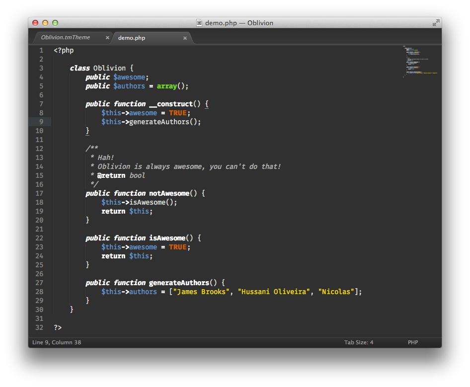

# Oblivion - Sublime Text Theme

A Sublime Text Color Scheme based on Oblivion theme of Gedit in Ubuntu 11.10.

## Installation

Available via [Package Control](https://sublime.wbond.net/installation) - search for "Oblivion Color Scheme".

If you don't have Git installed, then you can download the released version [here](https://github.com/jbrooksuk/Oblivion/releases). Just extract the Zip or Tar file into your `Packages/User` directory.

### Sublime Text 3

**Linux**

	cd ~/.config/sublime-text-3/Packages
	git clone https://github.com/jbrooksuk/Oblivion.git

**Mac OSX**

	cd ~/Library/Application\ Support/Sublime\ Text\ 3/Packages
	git clone https://github.com/jbrooksuk/Oblivion.git

**Windows**

	cd ~/Library/Application\ Support/Sublime\ Text\ 3/Packages
	git clone https://github.com/jbrooksuk/Oblivion.git

### Sublime Text 2

**Linux**

	cd ~/.config/sublime-text-2/Packages
	git clone https://github.com/jbrooksuk/Oblivion.git

**Mac OSX**

	cd ~/Library/Application\ Support/Sublime\ Text\ 2/Packages
	git clone https://github.com/jbrooksuk/Oblivion.git

**Windows**

	cd ~/Library/Application\ Support/Sublime\ Text\ 2/Packages
	git clone https://github.com/jbrooksuk/Oblivion.git

# Source
Using [TTheme](http://github.com/jbrooksuk/TTheme) we're able to generate `tmTheme` files from YAML. This allows us to easily customise and quickly modify the themes. There are [plans](https://github.com/jbrooksuk/Oblivion/issues/3) to generate various versions of Oblivion, including:

- Light
- Soda Light
- High Contrast

But this will take further work to write a decent generator that can take the [Oblivion colour palette](https://github.com/jbrooksuk/Oblivion/blob/master/src/palette.yml) and generate these files.

# Credits
	
The .tmTheme file was originally created by Paolo Borelli.

Additional credits to:

- [James Brooks](http://github.com/jbrooksuk)
- [Hussani Oliveira](http://github.com/hussani)
- [Nicolas](http://github.com/tMaxx)
- [natestedman](http://github.com/natestedman) *for Morrowind.*